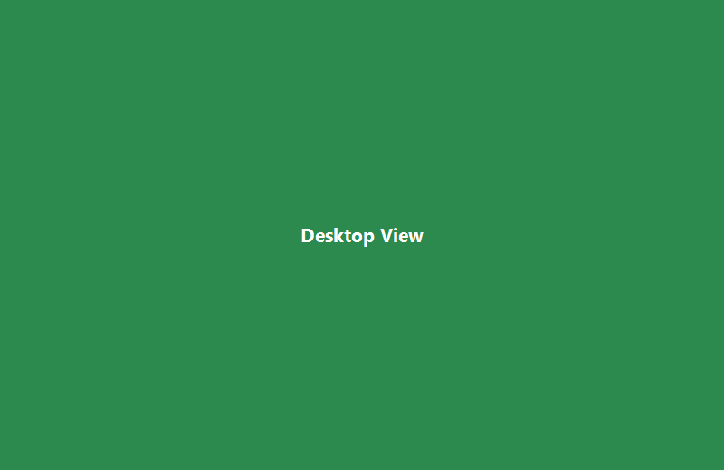

<div align="center">

# ⚽ Football Tactics Board

**足球排兵布阵战术板**

[](https://developer.mozilla.org/en-US/docs/Web/HTML)
[](https://developer.mozilla.org/en-US/docs/Web/CSS)
[](https://developer.mozilla.org/en-US/docs/Web/JavaScript)
[](https://web.dev/progressive-web-apps/)
[](LICENSE)

*A lightweight, zero-dependency football tactics board that works on desktop and mobile.*

</div>

---

## 🌐 在线体验 | Online Demo

> 🚀 **Live Demo:** [https://ygnehcz.github.io/Football-Tactics-Board/](https://ygnehcz.github.io/Football-Tactics-Board/)
>
> *部署于 GitHub Pages，打开即可使用。*

---

## 📖 项目简介 | About

Football Tactics Board 是一个**纯前端网页应用**，帮助教练和球迷快速布置足球阵型、调整球员站位，并导出战术图。

- 🖥️ 桌面端 & 📱 手机端 — 响应式设计，全平台可用
- 🚫 零构建工具 — 纯 HTML + CSS + JavaScript
- 📦 零依赖 — 仅按需加载 html2canvas CDN
- 🔧 代码结构清晰 — 适合初学者学习与二次开发

## ✨ 功能特性 | Features

<table>
<tr>
<td width="50%">

### 🎯 当前功能 (V0.1.1)

- ✅ **5/7/8/11 人制**切换，内置 13 种预设阵型
- ✅ 球员圆点**自由拖动**（Pointer Events 统一鼠标 + 触摸）
- ✅ 点击球员**编辑号码、姓名、位置**
- ✅ **保存/加载**阵型（localStorage 持久化）
- ✅ 一键**导出 PNG 图片**（含阵型标签水印）
- ✅ **主/客队服颜色切换**（6 种配色方案）
- ✅ **Toast 提示系统** + 未保存修改确认
- ✅ 响应式布局，手机竖屏完美适配

</td>
<td width="50%">

### 🗺️ 后续计划

- [ ] V0.2：战术箭头、传球/跑位路线
- [ ] V0.3：替补席、球员名单管理、换人
- [ ] V0.4：多阵型保存、JSON 导入导出
- [ ] V0.5：PWA 离线支持、添加到桌面
- [ ] GitHub Pages 正式部署

</td>
</tr>
</table>

## 📸 截图展示 | Screenshots

<div align="center">

| 桌面端 | 手机端 | 导出效果 |
|:---:|:---:|:---:|
|  |  |  |
| *桌面浏览器布局* | *手机竖屏适配* | *PNG 导出含阵型标签* |

</div>

> 💡 截图占位 — 运行项目后替换 `docs/images/` 下的实际截图。

## 🧩 预设阵型 | Formations

| 人数 | 可选阵型 |
|------|----------|
| **5人制** | 1-2-1 · 2-1-1 · 1-1-2 |
| **7人制** | 2-3-1 · 3-2-1 · 2-2-2 |
| **8人制** | 2-3-2 · 3-3-1 · 2-4-1 |
| **11人制** | 4-3-3 · 4-2-3-1 · 4-4-2 · 3-5-2 |

## 🚀 快速开始 | Quick Start

```bash
# 方式一：直接浏览器打开
# 双击 index.html 即可使用

# 方式二：本地服务器预览
python -m http.server 8080
# 然后打开 http://localhost:8080
```

> 无需 `npm install`，无需构建工具。克隆即用。

## 📁 项目结构 | Project Structure

```
Football-Tactics-Board
├── index.html          # 主页面 + DOM 结构
├── style.css           # 响应式样式（移动端优先）
├── app.js              # 核心逻辑（阵型/拖动/编辑/保存/导出）
├── README.md           # 项目说明（本文件）
├── docs
│   ├── project_plan.md # 项目规划与版本路线图
│   └── images/         # 截图资源
└── assets
    └── .gitkeep        # 资源目录占位
```

## 🔧 技术栈 | Tech Stack

| 层级 | 技术 | 说明 |
|------|------|------|
| 结构 | **HTML5** | 语义化标签，无障碍支持 |
| 样式 | **CSS3** | Flexbox, CSS Variables, Media Queries, 渐变 |
| 逻辑 | **JavaScript (ES5)** | 兼容性好，不依赖转译工具 |
| 交互 | **Pointer Events** | 统一鼠标与触摸事件 |
| 导出 | **html2canvas** | CDN 按需加载 |
| 存储 | **localStorage** | 轻量级客户端持久化 |

## 🎨 颜色方案 | Color Schemes

| 位置 | 主队颜色 | 客队颜色 |
|------|----------|----------|
| 门将 (GK) | 🟡 金黄色 | ⚫ 灰黑色 |
| 后卫 (DF) | 🔵 蓝色 | 🟠 橙色 |
| 中场 (MF) | 🟢 绿色 | 🟣 紫色 |
| 前锋 (FW) | 🔴 红色 | 🔵 青蓝色 |

## 📱 已知兼容性 | Compatibility

| 平台 | 状态 |
|------|------|
| Chrome / Edge (Desktop) | ✅ 完全支持 |
| Firefox (Desktop) | ✅ 完全支持 |
| Safari (Desktop) | ✅ 完全支持 |
| Chrome (Android) | ✅ 完全支持 |
| Safari (iOS) | ✅ 完全支持 |
| 微信内置浏览器 | ✅ 支持 |

## 🤝 贡献 | Contributing

欢迎提交 Issue 和 Pull Request！

1. Fork 本仓库
2. 创建功能分支 (`git checkout -b feature/amazing-feature`)
3. 提交更改 (`git commit -m 'Add amazing feature'`)
4. 推送到分支 (`git push origin feature/amazing-feature`)
5. 创建 Pull Request

## 📄 许可 | License

MIT © [ygnehcz](https://github.com/ygnehcz)

---

<div align="center">
  <sub>Built with ❤️ and vanilla JavaScript</sub>
</div>